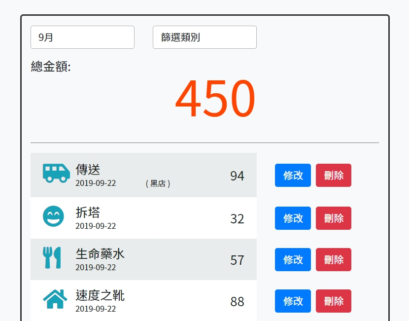

# Simple Expense Tracker
記帳介面太複雜？害怕被另一半發現偷買的遊戲點數？本款簡易記帳應用程式應運而生，將是你/妳記錄各項支出的最大武器。  

## Features
1. 使用者可以在首頁瀏覽所有支出的清單
2. 使用者可以在首頁看到所有支出的總金額
3. 使用者可以新增一筆支出
4. 使用者可以編輯支出的內容 (一次只能編輯一筆)
5. 使用者可以刪除任何一筆支出 (一次只能刪除一筆)
6. 使用者可以在首頁根據支出「類別」及「月份」交叉篩選支出
7. 使用者可以透過 email 及 password 註冊並登入
8. 使用者可以透過 Facebook 帳號登入
9. 使用者必須登入後才可以建立專屬於自己的支出清單
10. 使用者可以額外記錄支出商家

## Preview pages


## Environment and package used

* [Node.js](https://nodejs.org/en/) v10.15.0
* [Express.js](https://expressjs.com/) v4.17.1
* [express-handlebars](https://www.npmjs.com/package/express-handlebars) v3.1.0
* [Font Awesome](https://fontawesome.com/) v5.8.1
* [Bootstrap](https://getbootstrap.com/) v4.3.1
* [MongoDB](https://www.mongodb.com/download-center/community) v4.0.12
* [mongoose](https://mongoosejs.com/) v5.6.12
* [method-override](https://www.npmjs.com/package/method-override) v3.0.0
* [express-session](https://www.npmjs.com/package/express-session) v8.1.0
* [passport](https://www.npmjs.com/package/passport) v0.4.0
* [passport-local](https://www.npmjs.com/package/passport-local) v1.0.0
* [passport-facebook](https://www.npmjs.com/package/passport-facebook) v3.0.0
* [bcryptjs](https://www.npmjs.com/package/bcryptjs) v2.4.3
* [connect-flash](https://www.npmjs.com/package/connect-flash) v0.1.1
* [dotenv](https://www.npmjs.com/package/dotenv) v1.16.2

## Installation and usage

**複製專案**
```git=
git clone https://github.com/HuangMinShi/simpleExpenseTracker.git
```

**切換專案**
```git=
cd simpleExpenseTracker
```

**安裝環境**
```npm=
npm i express
```

**安裝 [MongoDB Community Server](https://www.mongodb.com/download-center/community)啟動資料庫**

**安裝專案套件**
```npm=
npm i express-handlebars nodemon mongoose method-override express-session passport passport-local passport-facebook bcryptjs connect-flash dotenv
```

**Facebook登入須於根目錄新增`.env`檔，並設置環境變數**
```
FACEBOOK_ID = ******
FACEBOOK_SECRET = ******
FACEBOOK_CALLBACK = http://localhost:3000/auth/facebook/callback
```
 
**新增種子資料及啟動伺服器**
```npm=
npm run seeder
npm run dev
```

**測試email及password**
- email: `user1@example.com` password: `12345`
- email: `user2@example.com` password: `12345`

**輸入URL**
```
http://localhost:3000
```
