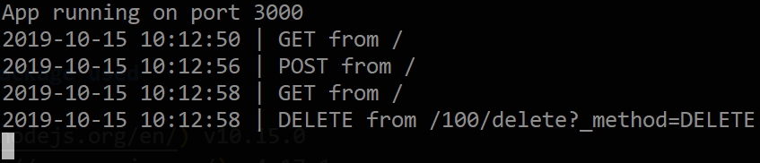
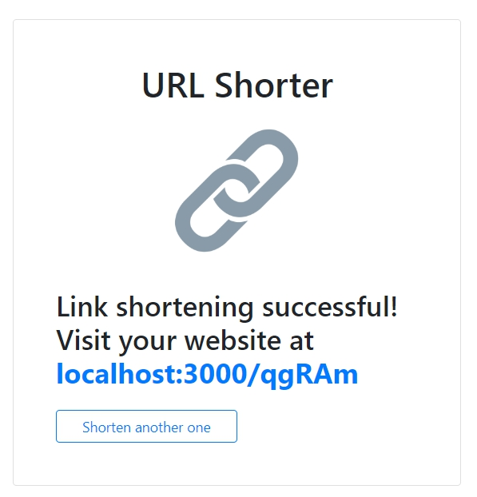

# URL Shorter
嘗試於 Node.js 環境引入 Express 框架及相關第三方套件並使用 MongoDB 資料庫實作產生短網址應用程式。

## Features
1. 使用者可以新增一組短網址
1. 使用者可以連結短網址

## Preview Pages



## Environment and package used
* [Node.js](https://nodejs.org/en/) v10.15.0
* [Express.js](https://expressjs.com/) v4.17.1
* [express-handlebars](https://www.npmjs.com/package/express-handlebars) v3.1.0
* [body-parser](https://www.npmjs.com/package/body-parser) v1.19.0
* [MongoDB](https://www.mongodb.com/download-center/community) v4.0.12
* [mongoose](https://mongoosejs.com/) v5.6.12

## Installation and usage
**複製專案**
```git
git clone https://github.com/HuangMinShi/URL_shorter.git

**切換專案**
```git
cd URL_shorter
```

**安裝環境**
```npm
npm i express
```

**安裝 [MongoDB Community Server](https://www.mongodb.com/download-center/community) 啟動資料庫**

**安裝專案套件**
```npm
npm i express-handlebars body-parser nodemon mongoose
```
 
**啟動伺服器**
```npm
npm run dev
```

**輸入URL**
```
http://localhost:3000
```

**部署**
同步部署於 [Heroku](https://fathomless-badlands-88408.herokuapp.com)