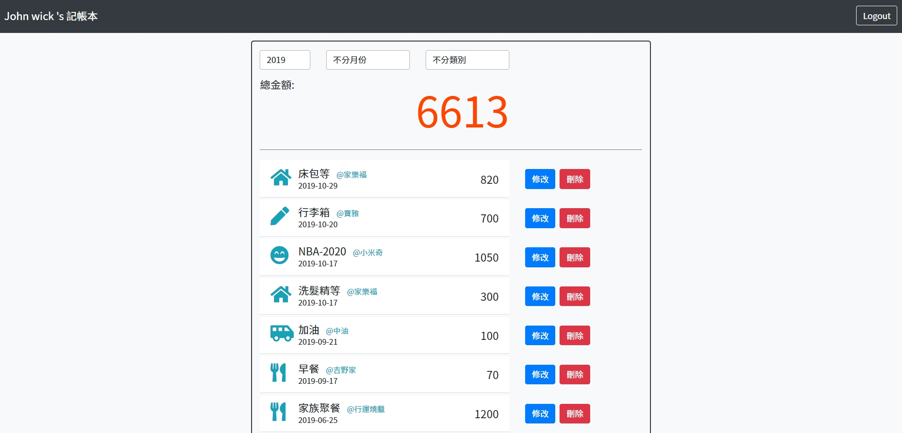
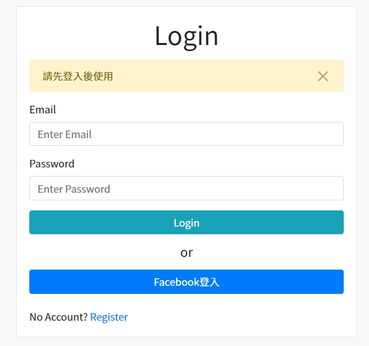

# Expense Tracker
嘗試於 Node.js 環境引入 Express 框架及相關第三方套件並使用 MySQL 資料庫實作簡單記帳應用程式。

## Features
1. 使用者可以瀏覽所有支出
2. 使用者可以新增一筆支出
3. 使用者可以編輯一筆支出
4. 使用者可以刪除一筆支出
5. 使用者可以看到支出總金額
6. 使用者可以依「類別」篩選支出
7. 使用者可以依「月份」篩選支出
8. 使用者可以依「年份」篩選支出
9. 使用者可以透過 email 及 password 註冊
10. 使用者可以透過 email 及 password 登入
11. 使用者可以透過 Facebook 帳號登入
12. 使用者登入後可以建立專屬於自己的支出

## Preview Pages



## Environment and package used
* [Node.js](https://nodejs.org/en/) v10.15.0
* [Express.js](https://expressjs.com/) v4.17.1
* [express-handlebars](https://www.npmjs.com/package/express-handlebars) v3.1.0
* [Font Awesome](https://fontawesome.com/) v5.8.1
* [Bootstrap](https://getbootstrap.com/) v4.3.1
* [method-override](https://www.npmjs.com/package/method-override) v3.0.0
* [express-session](https://www.npmjs.com/package/express-session) v8.1.0
* [passport](https://www.npmjs.com/package/passport) v0.4.0
* [passport-local](https://www.npmjs.com/package/passport-local) v1.0.0
* [passport-facebook](https://www.npmjs.com/package/passport-facebook) v3.0.0
* [bcryptjs](https://www.npmjs.com/package/bcryptjs) v2.4.3
* [connect-flash](https://www.npmjs.com/package/connect-flash) v0.1.1
* [dotenv](https://www.npmjs.com/package/dotenv) v1.16.2
* [mysql2](https://www.npmjs.com/package/mysql2) v1.7.0
* [sequelize](https://www.npmjs.com/package/sequelize) v5.19.5
* [sequelize-cli](https://www.npmjs.com/package/sequelize-cli) v5.5.1

## Installation and usage
**複製專案**
```git
git clone https://github.com/HuangMinShi/expense-tracker-sequelize.git
```

**切換專案**
```git
cd expense_tracker_sequelize
```

**安裝環境**
```npm
npm i express
```

**安裝 [MySQL](https://dev.mysql.com/downloads/windows/installer/) 並啟動資料庫**
1. 於 MySQL workbench 輸入以使用資料庫
```sql
drop database if exists expense_tracker_sequelize;
create database expense_tracker_sequelize;
use expense_tracker_sequelize;
```

2. 於 cls 輸入以建立資料綱要
```npm
npx sequelize db:migrate
```

3. 於 cls 輸入以建立種子資料
```npm
npx sequelize db:seed:all
```

4. 於 cls 輸入以刪除種子資料(若需要)
```npm
npx sequelize db:seed:undo:all
```

**修改config.json**
```json
"development": {
  "username": "root",
  "password": "${安裝SQL設定的password}",
  "database": "expense_tracker_sequelize",
  "host": "127.0.0.1",
  "dialect": "mysql"
}
```

**安裝專案套件**
```npm
npm i express-handlebars express body-parser nodemon mongoose method-override express-session passport passport-local passport-facebook bcryptjs connect-flash dotenv mysql2 sequelize sequelize-cli
```

**為支援Facebook登入請於根目錄新增`.env`檔，並設置環境變數**
```
FACEBOOK_ID = ******
FACEBOOK_SECRET = ******
FACEBOOK_CALLBACK = http://localhost:3000/auth/facebook/callback
```
 
**啟動伺服器**
```npm
npm run dev
```

**輸入URL**
```
http://localhost:3000
```